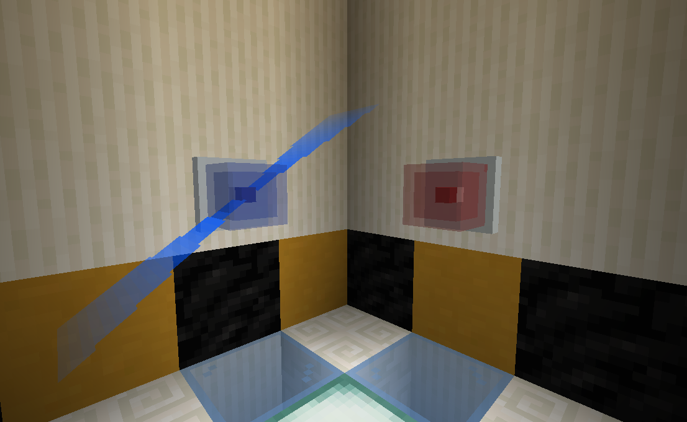
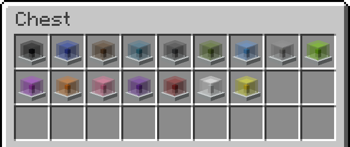
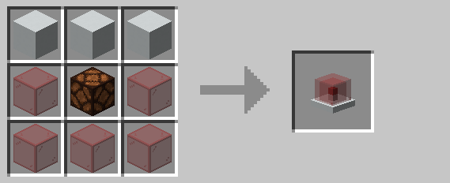

# Alarm Light

Alarm lights emit a glowing effect whenever they receive a wireless signal on their [channel](../mechanics/channels.md).
An alarm light cannot be placed unless a channel has been assigned using the [encoding station](encoding_station.md).

Alarm lights come in sixteen different colors, depending on which color of stained glass is used when crafting them.

## Crafting

## History

| Version |       Changes      |
| ------- | ------------------ |
| R1      | Added alarm lights |
