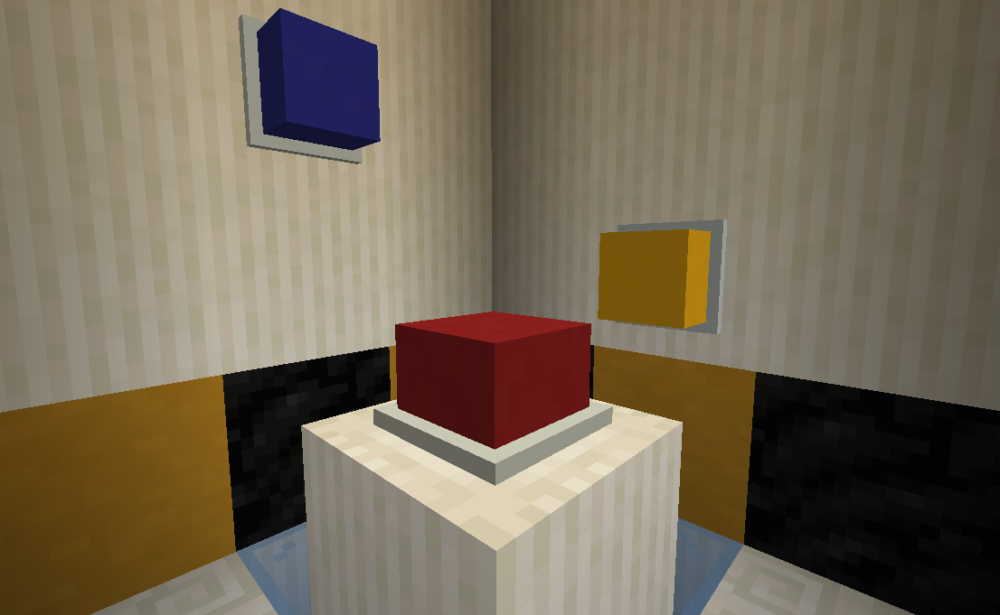
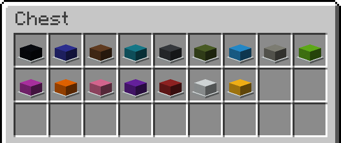
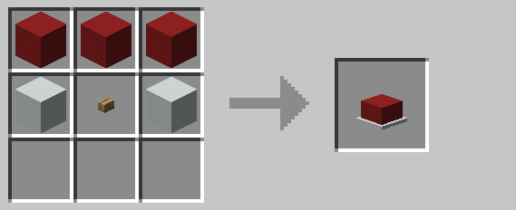

# Big Button

Big buttons function similar to ordinary buttons, emitting a redstone signal when pressed.  If assigned a
[channel](../mechanics/channels.md) using the [encoding station](encoding_station.md), they will additionally emit a
wireless redstone signal that can be picked up by nearby receivers on the same channel.

Alarm lights come in sixteen different colors, depending on which color of concrete is used when crafting them.

## Crafting

## History

| Version |      Changes      |
| ------- | ----------------- |
| R1      | Added big buttons |
| R3      | Encoding is now optional |
