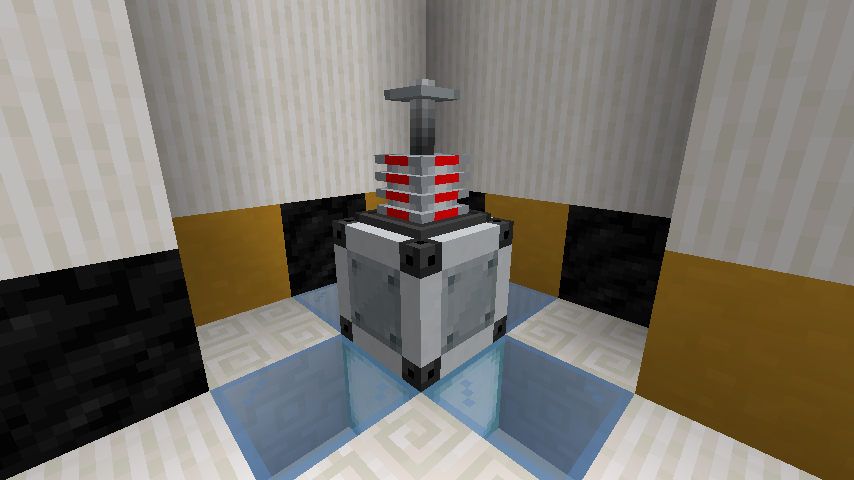
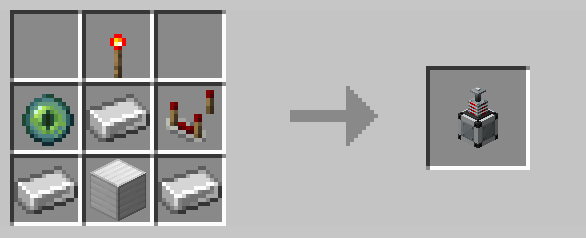

# Control Tower

The control tower was used to limit a [drone](drone.md)'s detection area to be within a thirty block radius centered 
around the tower, effectively giving it a "home" position.  The control tower affects any [drone](drone.md) with the
[control tower upgrade](control_tower_upgrade.md) and a matching code.

With the overhaul of [drone](drone.md) AI in R3, [drones](drone.md) now have a built-in home position that rendered control
towers obsolete.  As such, the control tower was removed in R3.

This block can be returned to its crafting materials using the [legacy wand](legacy_wand.md).

## Crafting

## History

| Version | Changes |
| ------- | ------- |
| R2      | Added control tower |
| R3      | Removed control tower |
