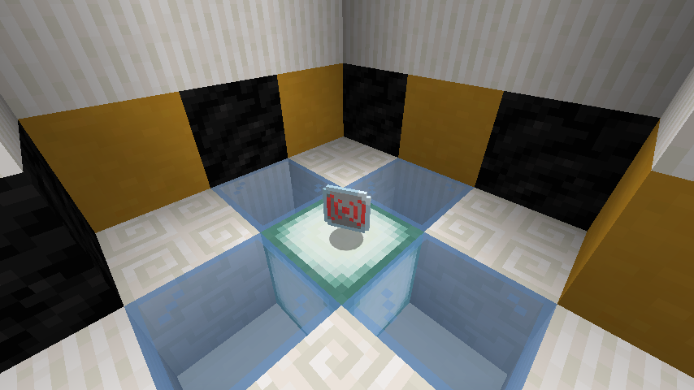
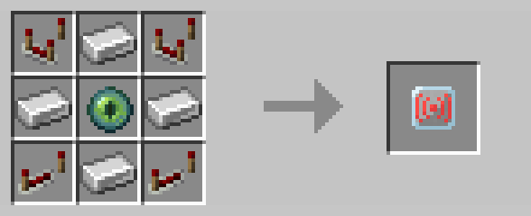

# Control Tower Upgrade

The control tower upgrade enabled a [drone](drone.md) to receive commands from [control towers](control_tower.md).
It could be applied by throwing the upgrade at the [drone](drone.md).

With the overhaul of [drone](drone.md) AI in R3, [drones](drone.md) now have a built-in home position that rendered
[control towers](control_tower.md) obsolete.  As such, the control tower upgrade was removed in R3.

This item can be returned to its crafting materials using the [legacy wand](legacy_wand.md).

## Crafting

## History

| Version | Changes |
| ------- | ------- |
| R2      | Added control tower upgrade |
| R3      | Removed control tower upgrade |
