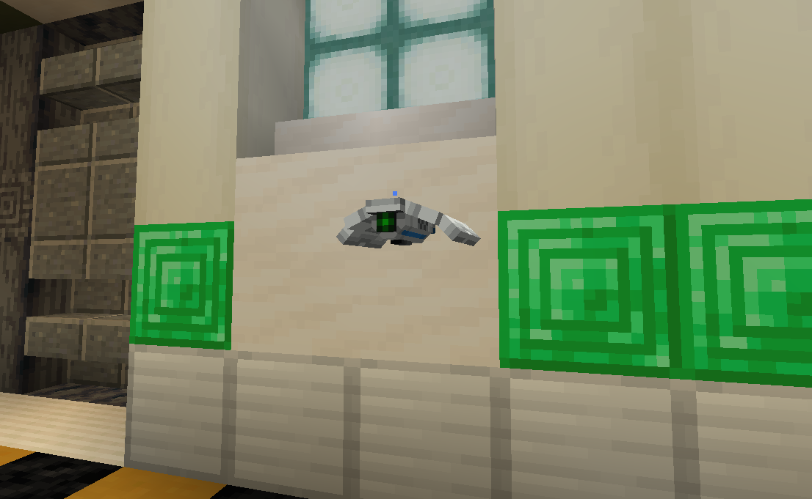
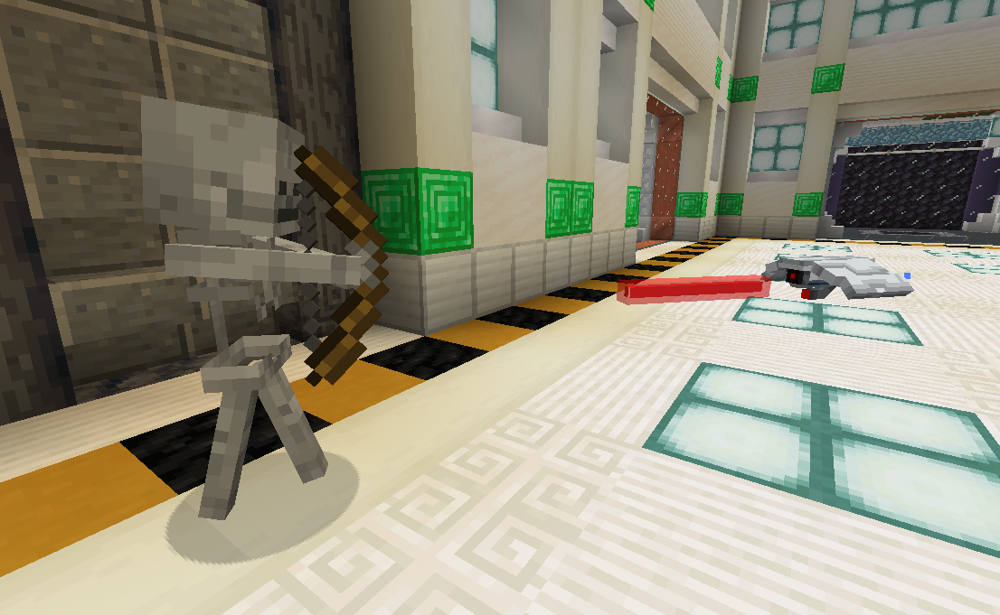
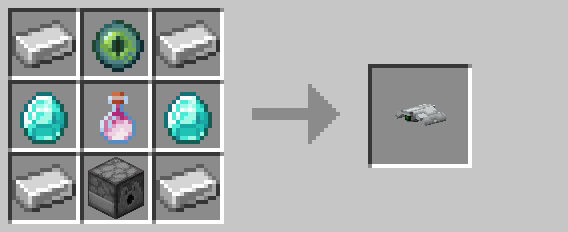

# Defense Drone



Defense drone behavior is divided into four distinct states:

* Patrolling
* Investigating
* Pursuing
* Attacking

In the "patrolling" state, drones will randomly navigate to points around their home position.  If the drone detects
anomalous activity—either an unknown entity within its line-of-sight, or fast motion—it enters the "investigating" state.

In the "investigating" state, drones will navigate towards the position where they last detected the suspicious activity.
Once reaching the point of interest, the drone will survey the area before returning to its "patrolling" state.  In this
state, the drone continuously assesses nearby entities to determine if they're hostile.  Entities approved by a drone do
not trigger it to investigate or attack, though approval will expire after a while.  However, if the drone detects an 
entity it deems to be hostile, it'll either enter the "pursuing" state, or the "attacking" state if it's close enough.

In the "pursuing" state, a drone will navigate towards its target until it's close enough to enter the "attacking" state.
During the "attacking" state, the drone repeatedly fires its laser until the enemy is either terminated or gets out of
range.



With ten health points and five damage per hit, drones are a weaker but mobile alternative to [turrets](turret.md).
Like [turrets](turret.md), drones slowly regenerate health over time.

## Encoding

Drones can optionally be given a code using the [encoder](encoding_station.md).  Drones given a code will attack other 
drones, [turrets](turret.md), and players with a non-matching code.  A player's "code" is simply that of their last held 
[keycard](keycard.md).  Once approved, an entity will not be targeted again until their approval expires, even if they 
hold a non-matching [keycard](keycard.md).


## Crafting




## Pre-R3 Behavior

Prior to release 3, drones would remain stationary unless a viable target entered within fifteen blocks.  Drones would
then pursue the closest target until they were within five blocks, at which point the drone would begin firing with its
laser.

Since the ability for drones to "approve" entities did not exist prior to R3, any player that switched to a non-matching
[keycard](keycard.md) would be immediately attacked.


## Unused/Operator-Only Features

### Dyeable Drones

The outer shell and glow layers can be individually colored using commands.  For example, the following command gives the
nearest drone a blue shell and yellow lights:

```mcfunction
/data modify entity @n[tag=lockdown.drone,tag=lockdown.block.display] item.components."minecraft:custom_model_data".colors set value [[0.4, 0.4, 0.8], [1.0, 1.0, 0.25]]
```

These colors persist even when the drone is broken and replaced.

Unfortunately, this feature did not make it to survival-accessibility in R3.  Instead, it is planned for R4 alongside a few
other drone customization features.


### Berzerker Drones

Giving the "lockdown.behavior.code_hostile" tag to an entity allows it to be targeted by a drone with a code, even if the
entity is not normally targetable.  For example, the following command makes the nearest villager targetable:

```mcfunction
/tag @n[type=minecraft:villager] add lockdown.behavior.code_hostile
```


## History

| Version | Changes |
| ------- | ------- |
| R1      | • Added drones |
| R2      | • Added drone upgrades |
| R3      | • Overhauled drones, with new AI, model, and sound effects<br>• Tweaked recipe |

