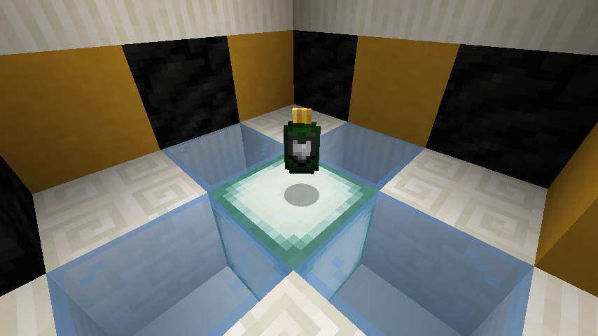
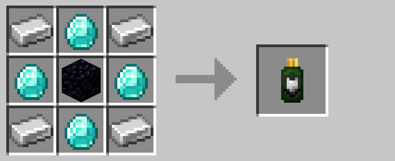

# Durability Upgrade

Durability upgrades increase the maximum health of [drones](drone.md) and [turrets](turret.md) by three points per 
upgrade.  Up to three durability upgrades may be applied to any given [drone](drone.md)/[turret](turret.md).

Upgrades are applied by right-clicking on the target entity.

## Crafting

## Pre-R3 Behavior

Prior to R3, upgrades were applied by throwing them at [drones](drone.md)/[turrets](turret.md).

## History

| Version | Changes |
| ------- | ------- |
| R2      | • Added keycard |
| R3      | • Increased maximum upgrades to three • Now applied by right-clicking • No longer mutually-exclusive with other upgrades |

