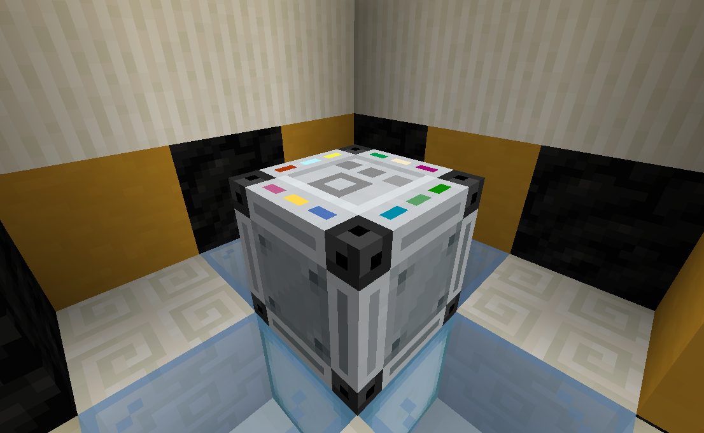
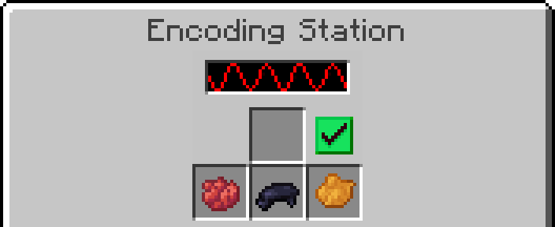
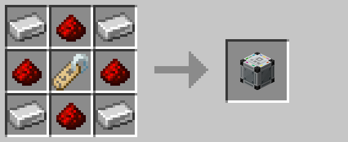

# Encoding Station

The encoding station is used to apply codes/[channels](../mechanics/channels.md) to several Lockdown devices, including:

* [Alarm lights](alarm_light.md)
* [Big Buttons](big_button.md)
* [Defense drones](drone.md)
* [Defense Turrets](turret.md)
* [Keys](key.md)
* [Keycard Readers](keycard_reader.md)
* [Keycards](keycard.md)

To apply a code or [channel](../mechanics/channels.md), first place any dye in the bottom three slots.  Then, place the
item to encode in the upper slot, and click the checkmark button.  If the item could not be encoded, an error message is
displayed in the player's chat.

## Crafting

## History

| Version | Changes |
| ------- | ------- |
| R1      | Added encoding station |

