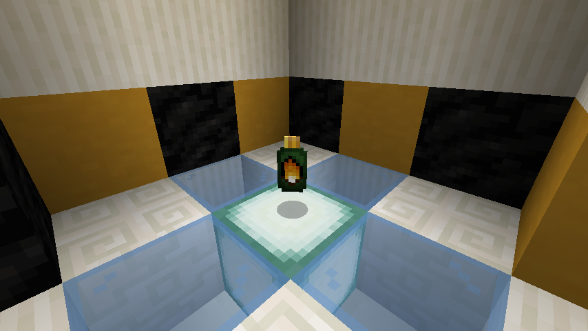
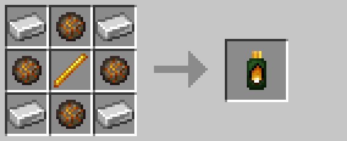

# Flamethrower Upgrade

The flamethrower upgrade allows [drones](drone.md) to shoot fireballs and [turrets](turret.md) to shoot bolts of fire.  Up to
*one* flamethrower upgrade may be applied to any given [drone](drone.md)/[turret](turret.md).

Upgrades are applied by right-clicking on the target entity.

## Crafting

## Pre-R3 Behavior

Prior to R3, the flamethrower upgrade allowed [drones](drone.md) and [turrets](turret.md) to light the ground underneath
their target on fire.  The laser particle effects would also be replaced by flame particles.

Additionally, upgrades were applied by throwing them at [drones](drone.md)/[turrets](turret.md).

## History

| Version | Changes |
| ------- | ------- |
| R2      | • Added flamethrower upgrade |
| R3      | • Now causes drones to shoot fireballs instead of lighting fires • Now applied by right-clicking • No longer mutually-exclusive with other upgrades |

