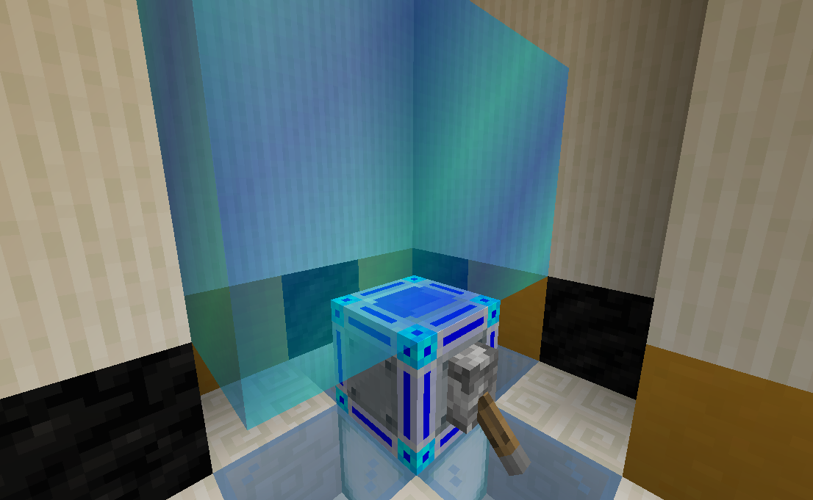
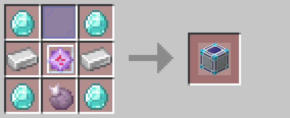

# Force Field Projector

Force field projectors generate an indestructible energy field when powered by redstone.  Right-clicking the projector
will adjust its size, from 1x1 at the smallest to 5x5 at the largest.  Force field projectors face away from the block
they are placed against.

## Crafting

## History

| Version | Changes |
| ------- | ------- |
| R1      | • Added force field projector |
| R3      | • Tweaked texture to show directionality • Added brief raising/lowering animation to the shield • Can now be placed horizontally and upside-down |

