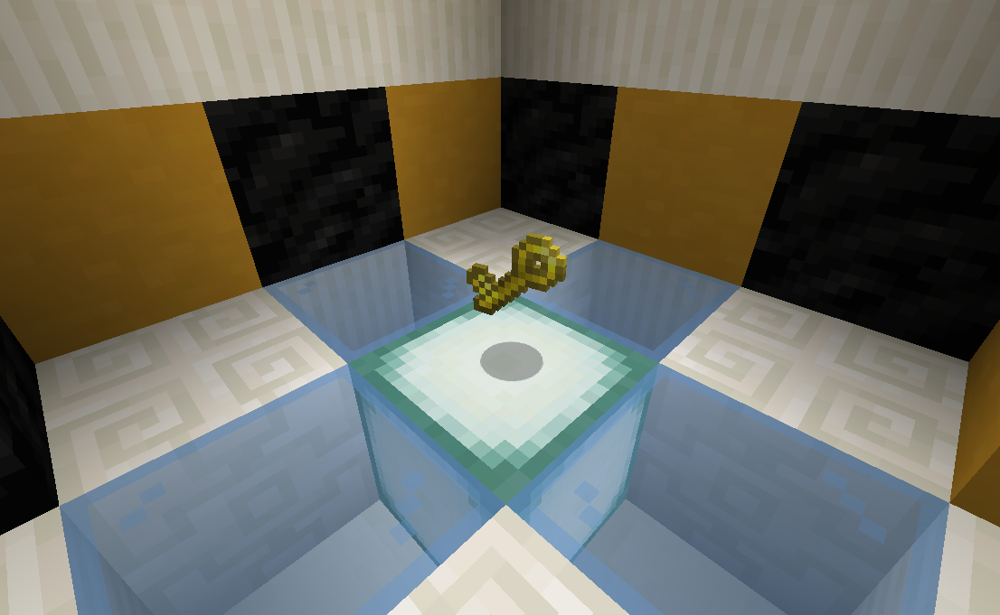
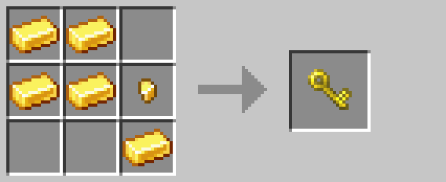

# Key

The key brings vanilla container locking to survival.  To use it, assign a code using the 
[encoding station](encoding_station.md).  Then, sneak+use on a container to lock it.  A locked container can only be
opened while holding a key with a matching code.  To remove the lock, sneak+use on the container again.

## Crafting

## History

| Version | Changes   |
| ------- | --------- |
| R3      | Added key |

