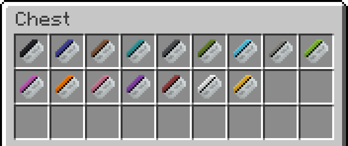
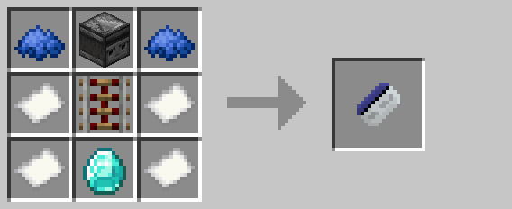

# Keycard

Keycards are used by [keycard readers](keycard_reader.md) and [drones](drone.md) to authenticate players.  When held,
matching [keycard readers](keycard_reader.md) within five blocks will output a signal.  Additionally, [drones](drone.md)
that have been assigned a code will not attack players whose last-held keycard matches their code.

## Crafting

## History

| Version | Changes |
| ------- | ------- |
| R1      | • Added keycard |
| R3      | • Keycards are now available in sixteen colors • Tweaked recipe to be slightly simpler |
