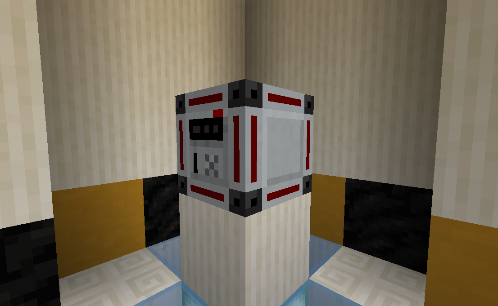
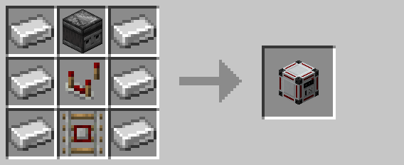

# Keycard Reader

Keycard readers emit a redstone signal whenever a player within five blocks holds a keycard with a matching code.

A keycard reader can be placed directionally, with the front always facing the player when placed.  However, they cannot
be placed without first being assigned a code using the [encoding station](encoding_station.md).

## Crafting

## Pre-R3 Behavior

Prior to R3, keycard readers were *not* full blocks and emitted wireless signals instead of redstone power.

## History

| Version | Changes |
| ------- | ------- |
| R1      | • Added keycard reader |
| R3      | • Made into a full block • Now emits a redstone signal instead of a wireless one • Changed recipe to require fewer types of materials |

