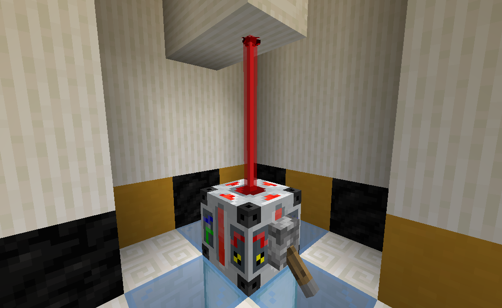
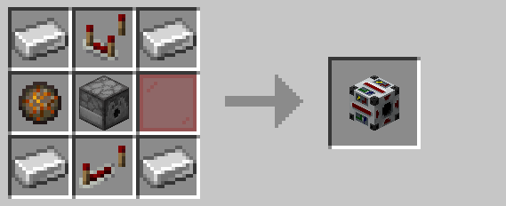

# Laser Projector

The laser projector emits a deadly laser beam when powered by redstone.  The laser has a maximum range of ten blocks and
deals damage to any entity it passes through.  Additionally, the laser beam can be blocked by solid, non-transparent
blocks.

## Crafting

## Pre-R3 Behavior

Prior to R3, the laser projector fired a fixed distance of five blocks and could not be blocked.

## History

| Version | Changes |
| ------- | ------- |
| R1      | • Added laser projector |
| R3      | • Can now be placed vertically • Beam can now be blocked by solid blocks • Increased range to ten blocks |
