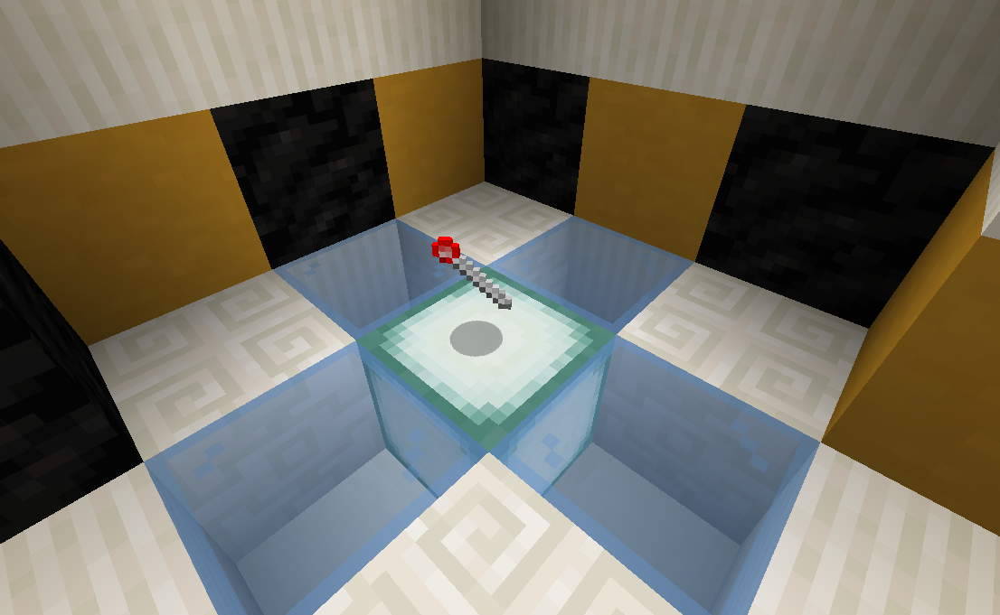
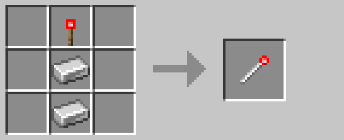

# Legacy Wand

Due to significant rewrites in R3, all items/blocks added by R1.X and R2.X versions of the datapack are incompatible 
with their R3 counterpart.  The legacy wand allows players to upgrade these legacy items/blocks to their modern versions.

When right-clicked on a legacy Lockdown block, the block will be destroyed and returned to item form.  Additionally,
any legacy items/blocks in the player's inventory will be replaced with their modern counterpart when using the wand.
If the item/block no longer exists in modern versions of the pack, the crafting materials will be returned instead.

## Crafting

## History

| Version | Changes           |
| ------- | ----------------- |
| R3      | Added legacy wand |

