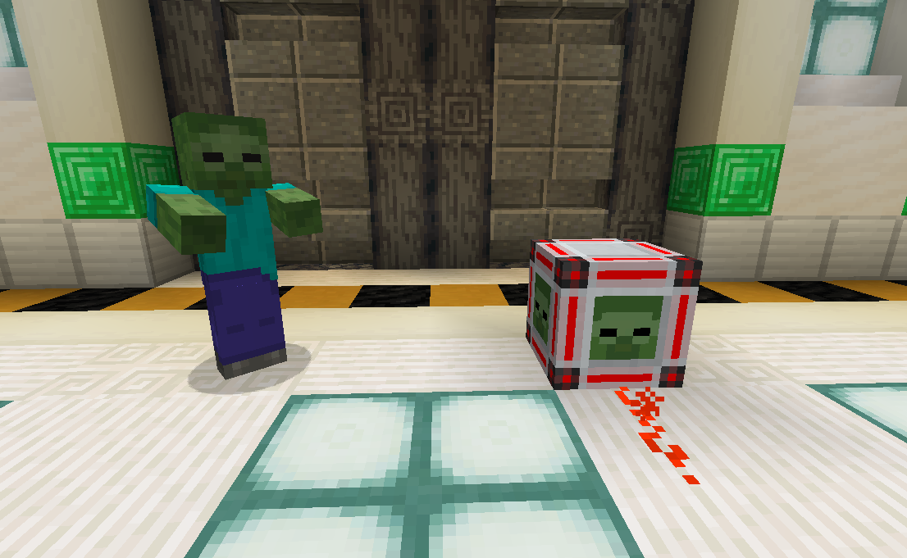
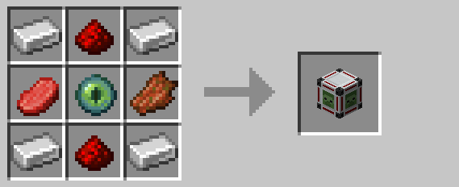

# Mob Detector

The mob detector emits a redstone signal whenever a non-player mob is within five blocks.  Technical entities such as
falling blocks, item displays, projectiles, etc. do not trigger the mob detector.

## Crafting

## History

| Version | Changes |
| ------- | ------- |
| R1      | Mob detector |
| R3      | Tweaked recipe to allow more item substitutes |

