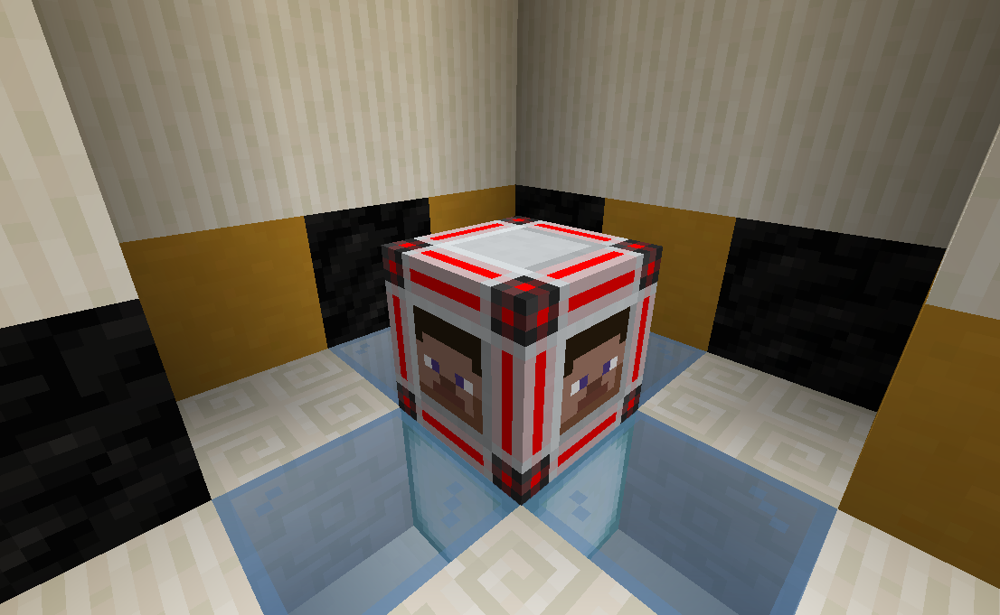
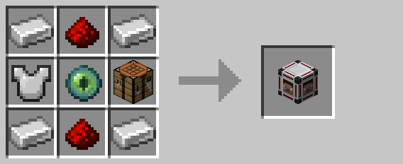

# Player Detector

The player detector emits a redstone signal whenever a player is within five blocks.

## Crafting

## History

| Version | Changes |
| ------- | ------- |
| R1      | Player detector |
