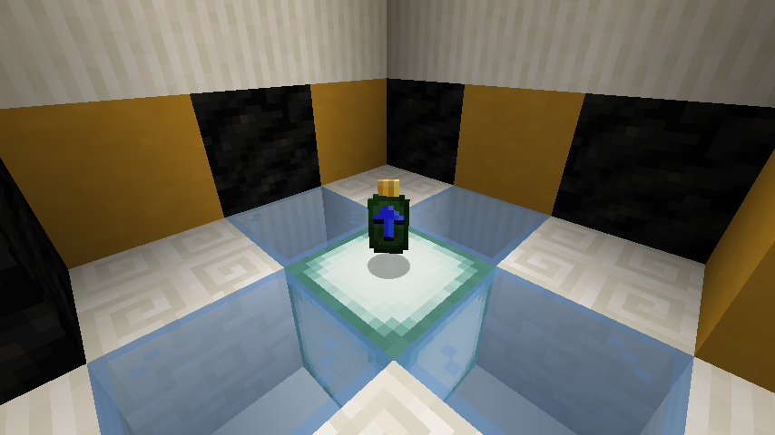
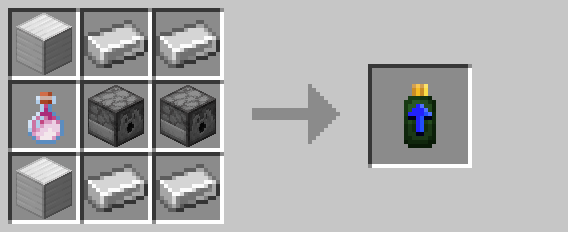

# Range Upgrade

The range upgrade increases the effective range of [drones](drone.md) and [turrets](turret.md).  For [drones](drone.md),
this includes the patrol area, detection area, and attack range.  For [turrets](turret.md), this is the maximum distance
the [turret](turret.md) can target and fire.

Upgrades are applied by right-clicking on the target entity.

## Crafting

## History

| Version | Changes |
| ------- | ------- |
| R3      | Added range upgrade |
