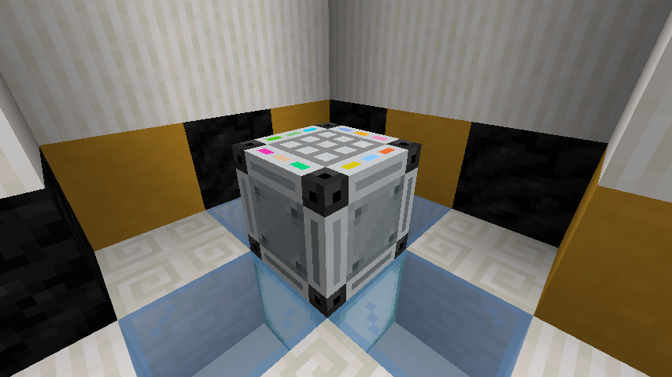
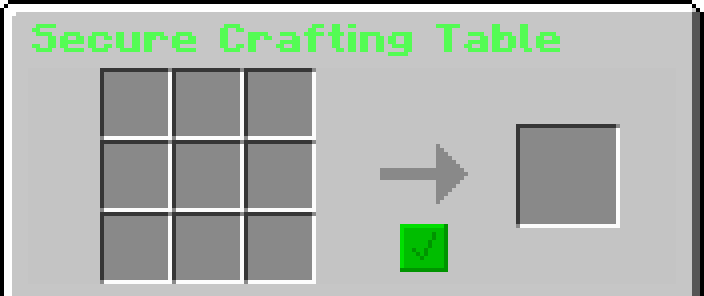
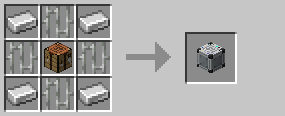

# Secure Crafting Table

The secure crafting table was the primary method for crafting Lockdown machines and items prior to R3.  It functioned
similar to a regular crafting table, aside from the output not displaying automatically.

It was initially added due to technical limitations within the base game.  However, with 1.20.5 enabling recipe outputs
to have custom data, it was no longer required and has since been removed.

This block can be returned to its crafting materials using the [legacy wand](legacy_wand.md).

## Crafting

## History

| Version | Changes |
| ------- | ------- |
| R1      | Added secure crafting table   |
| R3      | Removed secure crafting table |
