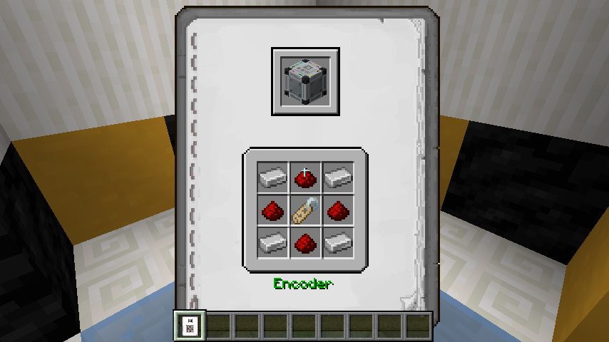
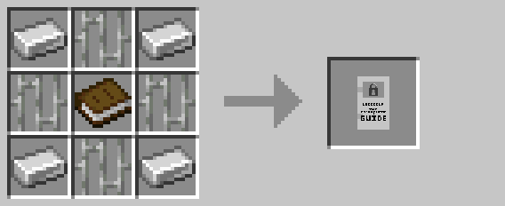

# Secure Recipe Book

The secure recipe book listed recipes usable in the [secure crafting table](secure_crafting_table.md) prior to R3.
Players could cycle between recipes using right-click and shift+right-click.

The secure recipe book was initially added due to technical limitations within the base game.  However, with 1.20.5 
enabling recipe outputs to have custom data, it was no longer required and has since been removed.

This item can be returned to its crafting materials using the [legacy wand](legacy_wand.md).

## Crafting

## History

| Version | Changes                  |
| ------- | ------------------------ |
| R1      | Added secure recipe book |
| R1.2    | Fixed bug where recipe book disappeared in survival |
| R3      | Removed secure recipe book |
