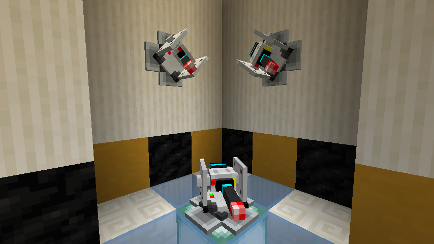
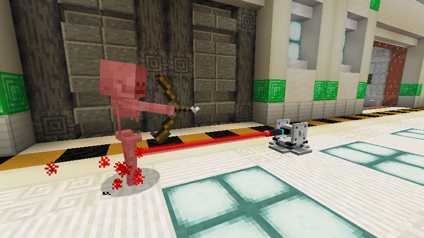
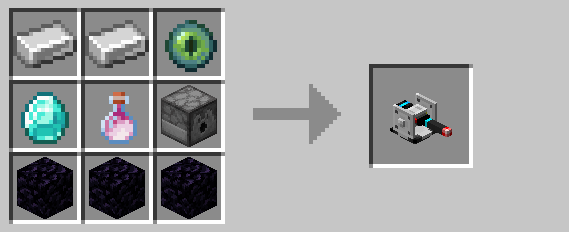

# Defense Turret

The defense turret blasts hostile mobs and, optionally, players with a laser.  By default, turrets only target hostile mobs
within its firing range, prioritizing the closer ones.  However, it can be [given a code](#encoding) to attack players as
well.

With eighteen health points and eight damage per hit, turrets are a stronger but immobile alternative to [drones](drone.md).
Like [drones](drone.md), turrets slowly regenerate health over time.

## Encoding

Turrets can optionally be given a code using the [encoder](encoding_station.md).  Turrets given a code will attack other 
[drones](drone.md), turrets, and players with a non-matching code.  A player's "code" is simply that of their last held 
[keycard](keycard.md).  Once approved, an entity will not be targeted again until their approval expires, even if they 
hold a non-matching [keycard](keycard.md).

## Crafting

## History

| Version | Changes |
| ------- | ------- |
| R1      | • Added turrets |
| R2      | • Buffed firing range • Lowered reload time • Made recipe less expensive |
| R3      | • Can now be placed on all sides of a block • Can now visually rotate around two axes • Added new sounds and a dedicated laser model • Reduced recipe cost to be more in line with drones |

