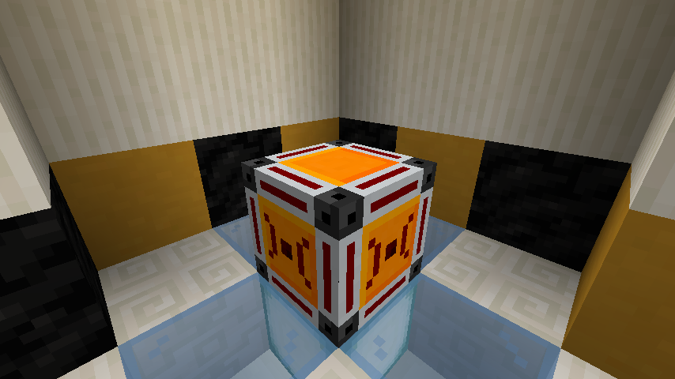
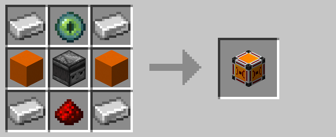

# Wireless Receiver

The wireless receiver emits a redstone signal when it receives a wireless signal on its [channel](../mechanics/channels.md).
This block cannot be placed until it has been assigned a [channel](../mechanics/channels.md) using the 
[encoding station](encoding_station.md).

## Crafting

## History

| Version |       Changes      |
| ------- | ------------------ |
| R1      | Added wireless receiver |

