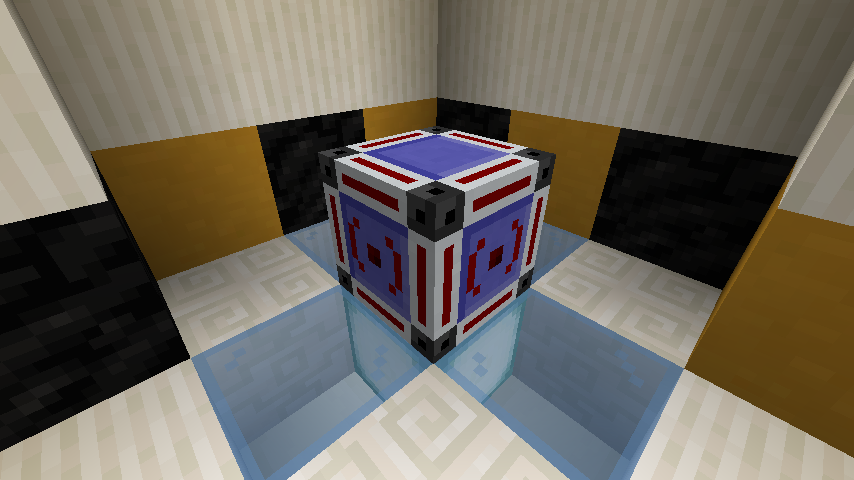
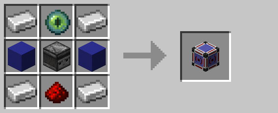

# Wireless Transmitter

When powered by a redstone signal, the wireless transmitter broadcasts a wireless signal to all
[receivers](wireless_receiver.md) on its [channel](../mechanics/channels.md).  This block cannot be placed until it has 
been assigned a [channel](../mechanics/channels.md) using the [encoding station](encoding_station.md).

## Crafting

## History

| Version | Changes |
| ------- | ------- |
| R1      | Added wireless transmitter |

